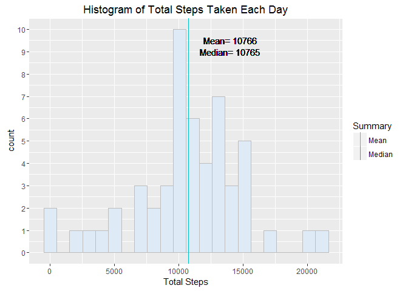
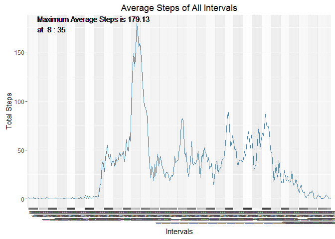
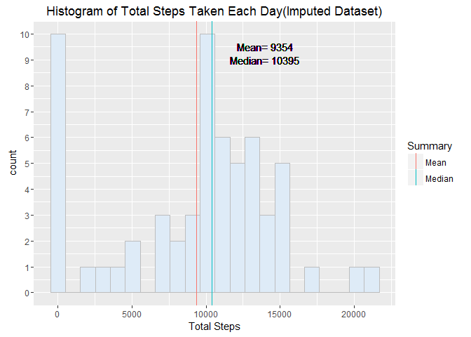
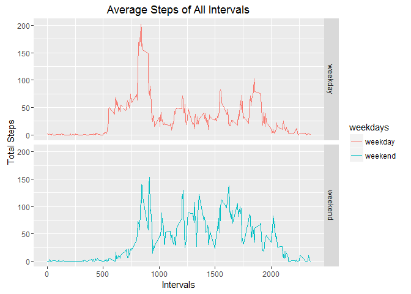

Loading and preprocessing the data
----------------------------------

``` r
url = "https://d396qusza40orc.cloudfront.net/repdata%2Fdata%2Factivity.zip"
if(!file.exists("repdata-data-activity.zip")) {
  download.file(url,"repdata-data-activity.zip")
  unzip("repdata-data-activity.zip")
}
ACT <- read.csv("activity.csv")
```

Calculate the Daily Sum \#\#What is mean total number of steps taken per day?

``` r
ACT_Date_Sum<-ACT %>% group_by(date) %>% summarize(Total=sum(steps))
```

Calculate the Mean and Median of All Daily Sum

``` r
ACT_Date_Line=cbind(as.data.frame(rbind(mean(ACT_Date_Sum$Total,na.rm = T),median(ACT_Date_Sum$Total,na.rm = T))),Summary=c("Mean","Median"))
```

#### <span style="color:blue">Answer : Mean Total Number of Steps Taken Per Day = 10766</span>

    ## Warning: Removed 8 rows containing non-finite values (stat_bin).

<!-- -->

What is the average daily activity pattern?
-------------------------------------------

Calculate the 5-minute interval (x-axis) and the average number of steps taken, averaged across all days (y-axis)

``` r
ACT_Interval_Sum<-ACT %>% group_by(interval=as.factor(interval)) %>% summarize(Total=sum(steps,na.rm=T)/length(date))
ACT_Interval_Max<-ACT_Interval_Sum[which.max(ACT_Interval_Sum$Total),]
```

<!-- -->

Imputing missing values
-----------------------

Imputed by Replacing the NA with Group Mean

``` r
ACT_Imputed<-transform(ACT, steps = ifelse(is.na(steps), 
                       ave(steps, date, FUN = function(x) sum(x, na.rm = TRUE)/288), steps))
```

Calculate the Daily Sum of Imputed Data

``` r
ACT_Imputed_Date_Sum<-ACT_Imputed %>% group_by(date) %>% summarize(Total=sum(steps))
ACT_Imputed_Date_Line=cbind(as.data.frame(rbind(mean(ACT_Imputed_Date_Sum$Total,na.rm = T),
                                                median(ACT_Imputed_Date_Sum$Total,na.rm = T))),
                                                Summary=c("Mean","Median"))
```

#### <span style="color:blue">Answer : Mean Total Number of Steps Taken Per Day(Imputed Data) = 9354</span>

<!-- -->

Are there differences in activity patterns between weekdays and weekends?
-------------------------------------------------------------------------

Add Weekdays Column by Mutating from the date Column

``` r
ACT_Weekday<-ACT_Imputed %>% mutate(weekdays = ifelse(weekdays(as.Date(date))=="Saturday"|weekdays(as.Date(date))=="Sunday","weekend","weekday"))
```

Group by Weekdays/Weekend and Calculate the Mean

``` r
ACT_Weekday_group<-ACT_Weekday %>% group_by(interval,weekdays=as.factor(ACT_Weekday$weekdays))
ACT_Weekday_Sum<-as.data.frame(summarize(ACT_Weekday_group,Total=sum(steps)/length(date)))
```

#### <span style="color:blue">Answer : The Average Steps between 5~9am and 18~19pm is higher in Weekdays, but the Average Steps between 9am~18pm is higher in Weekend</span>

<!-- -->
